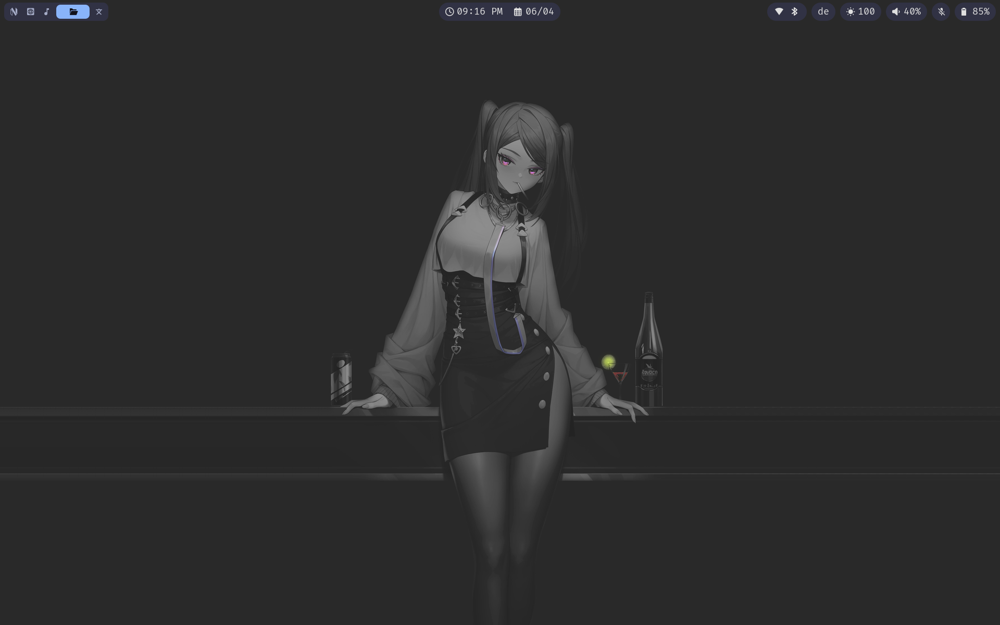
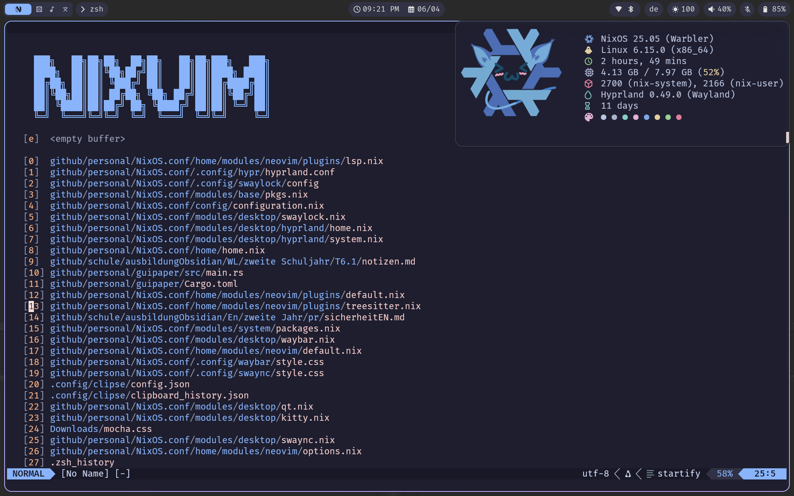
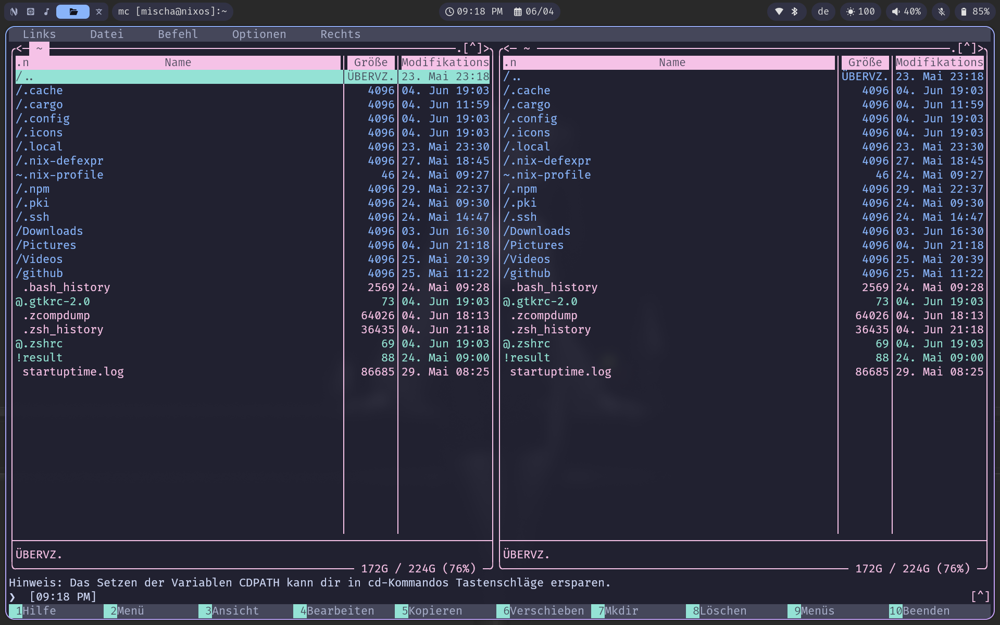

# NixOS.conf

**Author:** Kamidzu9 and [RakanMyHusbando](https://github.com/RakanMyHusbando)

## Description

Minimalistic Catppuccin-themed NixOS configuration with Home Manager and Hyprland.  
Includes a curated set of packages, desktop environment, CLI tools, and custom scripts for a modern, productive workflow.

## Features

- **DE/WM:** Hyprland
- **Shell:** zsh
- **Editor:** vscode
- **Prompt:** starship
- **Apps:** swaync, swaylock, waybar, prismlauncher, clipse (copy/paste manager), rofi
- **Languages/Environments:** Node.js, Python, Rust, Docker
- Preconfigured NixOS security and system hardening
- Preinstalled packages for Node.js, Python, and Rust development
- Custom wallpapers, pywal16 color integration, and themed configs for btop, mc, rofi, waybar, swaylock, etc.

## Screenshots





## Installation Instructions

1. Clone the repository:
   ```bash
   git clone https://github.com/Kamidzu9/NixOS.conf.git
   cd NixOS.conf
   ```

2. Run the installation script:
   ```bash
   ./install.sh
   ```

3. Apply the NixOS configuration:
   ```bash
   sudo nixos-rebuild switch
   ```

4. Reboot and type `Hyprland` in CLI to start the desktop environment.

## Usage

- Adjust the package list in [`config/configuration.nix`](config/configuration.nix) as needed.
- Customize user/environment variables in [`config/env.nix`](config/env.nix) (see [`config/env.nix.example`](config/env.nix.example)).
- Wallpapers and scripts are in [`assets/`](assets/) and [`scripts/`](scripts/).
- Home Manager modules are in [`modules/`](modules/).

## Resources

- [NixOS Handbook](https://nixos.org/manual/nixos/stable/)
- [Home Manager](https://github.com/nix-community/home-manager)

## License

See [LICENSE](LICENSE) if present.
